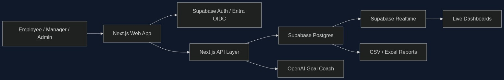

# GoalOps 🎯

> **Enterprise Goal Setting & Tracking Portal** — Built for the ATOMQUEST HACKATHON 1.0

GoalOps replaces scattered spreadsheets and appraisal chaos with a secure, audit-ready goal operating system for employees, managers, and HR.


---

## 🎯 Hackathon Evaluator Guide & Deliverables

**Welcome Judges!** To ensure a flawless evaluation experience, we have deployed the portal in an **"Ultra-Reliable Demo Mode"**. All data (users, goals, charts, logs) is securely pre-seeded in memory. **You do NOT need to configure a database or API keys to test this application.**

### ✅ Submission Deliverables Fulfilled
1. **Live Demo URL:** [👉 View Live Application Here 👈](https://goal-ops-brown.vercel.app/dashboard)
2. **Source Code:** [GitHub Repository](https://github.com/arnamchaurasiya/GoalOps)
3. **Architecture Diagram:** See the architecture diagram below.
4. **Login Credentials:** Bypassed for convenience. Use the **"Demo Role Switcher"** in the top right corner to instantly switch between Employee, Manager, and HR roles.

---

## 🏗 Architecture & Tech Stack


*(Note: If the image above does not load, please view the Mermaid architecture flow in the source code).*

**Tech Stack (Evaluation Parameter 6 - Cost Optimisation):**
We architected this for maximum efficiency and zero-idle costs.
- **Frontend**: Next.js 14 (App Router), TypeScript, Tailwind CSS, Framer Motion
- **AI Integration**: Google Gemini 1.5 Flash (Cheaper & faster for structured JSON extraction)
- **Database Schema**: Supabase PostgreSQL (14-table schema included in `/supabase`)
- **Hosting**: Vercel Serverless Functions

---

## 🏆 How We Solved The Problem Statement

### 1. Phase 1 — Goal Creation & Approval (Must-Have)
- **Goal Builder:** Employees can draft goals, select Thrust Areas, and assign UoM (Numeric, %, Binary).
- **Strict Validation Rules:** The UI math engine strictly enforces:
  - Total weightage must equal exactly **100%**.
  - Minimum weightage per goal is **10%**.
  - Maximum **8 goals** per employee.
- **Approval Workflow:** Managers have a dedicated Approval Queue to review goals, edit weightages inline, and click **Approve & Lock** (which freezes edits without Admin intervention).

### 2. Phase 2 — Achievement Tracking & Check-ins (Must-Have)
- **Quarterly Updates:** Employees log their Actual Achievement in the Update Progress screen.
- **System-Computed Scores:** Our mathematical engine normalizes scores across UoMs (automatically handling formulas for "Higher is Better", "Lower is Better", and "Zero-based").
- **Manager Check-ins:** Managers view Planned vs Actuals.
- **✨ OUR SECRET WEAPON (AI Assistant):** Instead of managers writing generic feedback, our integrated **Gemini AI** reads the employee's progress and auto-drafts structured coaching comments and questions!

### 3. Reporting & Governance Requirements
- **Exportable Reports:** HR can download CSVs of achievements via the Export Center.
- **Audit Trail:** Our dedicated Audit Log tracks every post-lock edit, capturing *who changed what and when*, complete with an interactive **JSON Diff Viewer**.

### 4. Good-to-Have Features (Section 5 Bonus Points)
We strategically focused on high-impact visual bonus features:
- **✅ 5.4 Analytics Module:** We built a comprehensive HR Dashboard featuring:
  - Recharts-powered pie charts for Goal Distribution by Status.
  - Animated Heatmaps for departmental completion rates.
  - Quarter-on-Quarter trend line charts.
- **✅ 5.2 Notifications (Simulated):** We built a beautiful slide-out Notifications Panel that alerts users to key events (e.g., Goals Approved, Check-ins Overdue).

---

## 🗺 Quick Demo Flow for Judges (How to Test)

1. **Open app** → See Employee dashboard (Alice Sharma)
2. Go to **My Goals** → View 4 goals totaling 100% weightage. Try to change one to 110% to see the validation block you!
3. Click **✨ sparkle** on a goal → See the AI Goal Coach transform it into a SMART goal.
4. **Submit to Manager** → Success confirmation.
5. **Switch to Bob Mehta** (Manager) via the top-right role switcher.
6. Go to **Approval Queue** → See Alice's sheet. Edit a weightage inline → **Approve & Lock**.
7. **Switch back to Alice** → Goals now show as 🔒 Locked.
8. Go to **Update Progress** → Enter Q1 actuals → See live mathematical scores.
9. **Switch to Bob** → Check-ins → Click **AI Draft** to auto-generate feedback → Submit.
10. **Switch to Carol** (Admin) → View HR Dashboard Analytics, Audit Logs, and test the CSV Exports.

---

## 🚀 Local Development (For Developers)

```bash
git clone https://github.com/arnamchaurasiya/GoalOps
cd GoalOps
npm install
npm run dev
```
Open [http://localhost:3000](http://localhost:3000). The app will run purely in Demo Mode without requiring database keys.

---
*Built with ❤️ for the Atomquest Hackathon 2026*
